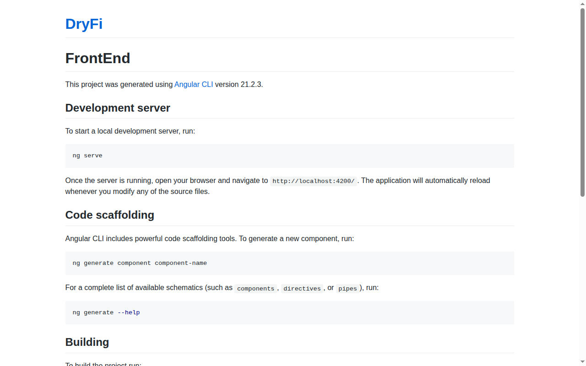

# DryFi

[](https://philgear.github.io/DryFi/front-end/)
*Click above to view the Live Demo*

DryFi is an IoT environmental monitoring dashboard displaying real-time indoor and outdoor metrics.

## Project Structure

- **`front-end/`**: Modern Angular 21 application built alongside Tailwind CSS v4. This is the primary Observer dashboard interface, utilizing Signals for reactive state management and a premium glassmorphic visual design.
- **`front-end-legacy/`**: Legacy version of the frontend application (do not modify).
- **`backend/`**: Arduino C++ hardware nodes responsible for collecting environmental data and pushing it into Adafruit IO.
- **`agent/`**: A Node.js AI agent powered by Genkit (`@genkit-ai/googleai`) and Express, providing intelligent data analysis capabilities to the dashboard.
- **`unity-globe/`**: Unity project directory containing assets for 3D interactions.

## Getting Started

### Frontend (Observer Dashboard)
To run the modern Angular frontend dashboard:
```bash
cd front-end
npm install
npm run start
```
*Note: We highly recommend using `npm run ng -- ...` or `npx @angular/cli@latest` for CLI commands to ensure local binary synchronization.*

### AI Agent
To run the Genkit-powered AI agent API:
```bash
cd agent
npm install
npm start
```
*(Ensure your `.env` file and `keys.json` are properly configured in the `agent` directory before starting).*

### IoT Backend
The Arduino sketches in the `backend/` directory can be flashed to your environment nodes via the Arduino IDE or PlatformIO. Ensure your Adafruit IO credentials are set up within the respective sketches.
